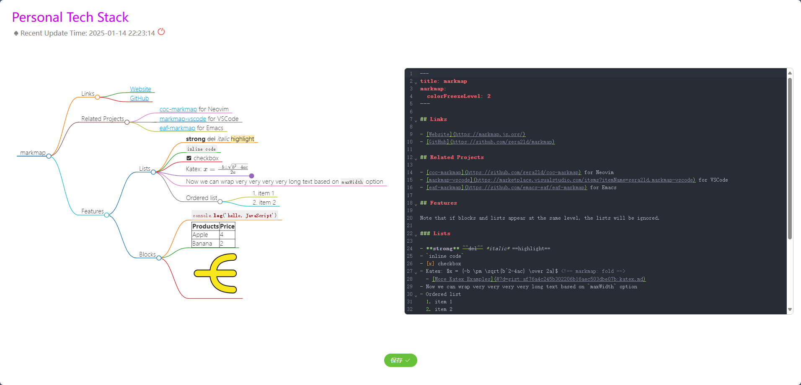

# sub_vue

个人技术栈前端展示页面

## Project Setup
初始化安装
```sh
npm install
```

### Compile and Hot-Reload for Development
运行
```sh
npm run dev
```

### Compile and Minify for Production

```sh
npm run build
```

### Lint with [ESLint](https://eslint.org/)

```sh
npm run lint
```
